# Flour & Ferment - E-commerce Web App

## Intro

For my fifth portfolio project, I created an e-commerce platform designed for sourdough bread baking enthusiasts.  The site allows users to browse and purchase a variety of sourdough equipment, from starters to flours, baking equipment and cookbooks.  Users can create accounts, manage orders, add products to their wishlist, contact the site administrators and receive email notifications for their purchases.

Administrators have the ability to manage products, respond to customer inquiries, and oversee transactions through a dedicated dashboard. Built using Django, PostgreSQL, and AWS, Flour & Ferment offers an engaging, user-friendly shopping experience for bakers of all levels.

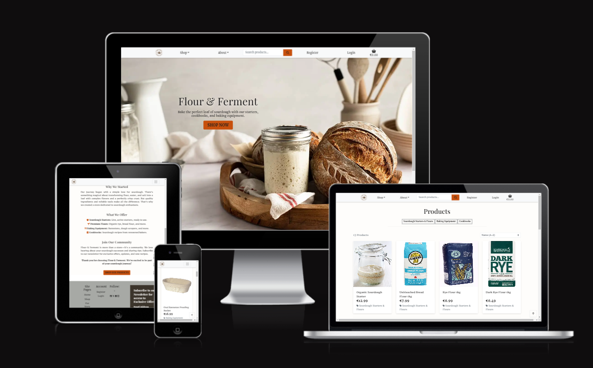

Visit the deployed site here: [Flour & Ferment](https://pp5-ci-flour-and-ferment-b9db037d992a.herokuapp.com/)

View Flour & Ferment on [Github](https://github.com/EJFleet/pp5-flour-and-ferment)

For Admin access with relevant sign-in information: [Flour & Ferment Admin](https://pp5-ci-flour-and-ferment-b9db037d992a.herokuapp.com/admin/)

For the details of all testing carried out, please go to [TESTING.MD](docs/testing/TESTING.md)


---

* [User Experience (UX)](#user-experience-ux)
  * [User Stories](#user-stories)
  * [Design](#design)
    * [Planning](#planning)
    * [Imagery](#imagery)

* [Features](#features)
  * [Future Implementations](#future-implementations)

* [Project Management & Agile Methodologies](#project-management--agile-methodologies)
  * [Kanban Board](#kanban-board)
  * [MoSCoW Prioritisation](#moscow-prioritisation)

* [Technologies Used](#technologies-used)
  * [Languages](#languages)
  * [Frameworks, Libraries & Packages](#frameworks-libraries--packages)
  * [Tools](#tools)

* [Deployment & Local Development](#deployment--local-development)
  * [Forking the GitHub Repository](#forking-the-github-repository)
  * [Cloning the GitHub Repository](#cloning-the-github-repository)
  * [Deploying to Heroku](#deploying-to-heroku)

* [Credits](#credits)
  * [Code Inspiration](#code-inspiration)
  * [Acknowledgments](#acknowledgments)

---

## User Experience (UX)

The user experience (UX) for this project was designed with careful consideration of user needs and project goals, ensuring a seamless, intuitive, and engaging experience for all users. The planning process was informed by Agile methodologies and centered around user stories, categorized into epics to structure development priorities effectively.

### The Five Planes of UX & Application to Flour & Ferment

The Five Planes of UX provide a structured approach to designing user experiences. These planes move from abstract concepts to concrete implementation, ensuring that both user needs and business objectives are met effectively. Here’s how they apply to **Flour & Ferment**.

#### **1. Strategy Plane: Defining User & Business Goals**
The **strategy** plane focuses on the purpose of the site and its intended audience.

- **Business Goals**: The primary objective of Flour & Ferment is to provide a **one-stop shop** for high-quality ingredients and specialized baking equipment for sourdough enthusiasts.
- **User Needs**: The platform caters to both **beginners** (starter kits, beginner-friendly tools) and **experts** (niche tools, cookbooks), ensuring an inclusive shopping experience.

#### **2. Scope Plane: Features & Functionality**
The **scope** plane defines what functionalities the site includes.

- **Core Features:**
  - Product browsing, product details, basket, checkout.
  - Wishlist and profile (order history, user details) for logged-in users.
  - FAQ, contact form, and “Our Story” page.
  - Admin panel with full CRUD functionality for managing products.
- **Deferred Features:** (Planned for future iterations)
  - Recipe section, product ratings and reviews, gift vouchers, baking classes.

#### **3. Structure Plane: Information Architecture & User Flow**
The **structure** plane determines how content is organized and how users navigate the site.

- **Navigation & Hierarchy:**
  - Clear categories for products (e.g., flours, equipment, cookbooks).
  - Users can easily access important sections: **Shop, Wishlist, Profile, FAQ, Contact**.
- **User Flow Considerations:**
  - Users land on the homepage, browse products via categories or search.
  - Clicking a product opens its **detail page**, where they can add it to their basket or wishlist.
  - Users proceed to checkout, entering details and making a secure payment.
  - Upon checkout, they receive confirmation and can track their orders in their **profile**.
  - Admins can manage products directly from the front end.

#### **4. Skeleton Plane: UI Design & Layout**
The **skeleton** plane deals with how elements are arranged on the page for usability and accessibility.

- **Intuitive Layout:**
  - The **navbar** provides clear navigation with login-dependent options.
  - A structured **product grid** with filtering and sorting enhances the shopping experience.
  - The **basket page** allows easy quantity adjustments before checkout.
- **Mobile Responsiveness:**
  - The site uses Bootstrap to ensure a **fully responsive** experience on all devices.
  - The navigation menu collapses into a mobile-friendly dropdown.

#### **5. Surface Plane: Visual Design & Branding**
The **surface** plane focuses on aesthetics and branding, reinforcing the platform’s identity.

- **Color Scheme:** Inspired by the warmth and authenticity of artisanal baking, the site uses **earthy tones**, complemented by deep contrasts for readability.
- **Typography:** A combination of **Playfair Display** (elegant serif) and **Merriweather** (highly readable body text) maintains a balance of sophistication and usability.
- **Imagery:** High-quality product images create a visually appealing experience, and hero images reinforce the passion behind sourdough baking.

#### **Conclusion**
By following the **Five Planes of UX**, Flour & Ferment delivers a **seamless and engaging user experience**, ensuring that both the business and its customers achieve their goals. The foundation is well-structured, with room for future enhancements to grow the platform.


### User Stories

#### **Navigation**  

As a user, I can:  
- Use a simple navigation menu so that I can easily find content.  
- View a responsive navigation menu on any screen size so that navigating the site remains easy on all my devices.  
- See login-dependent navbar links so that I can access relevant options when logged in or logged out.  

---

#### **Products**  

As a user, I can:  
- Browse a list of available products so that I can see what is for sale.  
- View details of a product so that I can learn more about it before purchasing.  
- Filter products by category so that I can find relevant items more easily.  
- Search for products so that I can find items that match my needs.  

As a logged-in user, I can:
- Add products to my wishlist so that I can easily find them for purchasing later.

---

#### **Shopping Basket**  

As a user, I can:  
- Add items to my basket so that I can purchase them later.  
- Remove items from my basket so that I can adjust my order before checkout.  
- See a summary of my basket so that I can review my order before purchasing.  
- View a running total of my basket so that I can keep track of my spending.  

---

#### **Purchasing & Checkout**  

As a user, I can:  
- Securely enter my payment and shipping details so that I can place an order.  
- See a confirmation page after placing an order so that I know my order was successful.  
- Receive an order confirmation email so that I have a record of my purchase.  

---

#### **User Authentication**  

As a user, I can:  
- Create an account so that I can save my details for future purchases.  
- Log in and out securely so that my account remains private.  

---

#### **User Profiles**  

As a logged-in user, I can:  
- View my past orders so that I can keep track of my purchase history.  
- Update my profile information so that my details are always correct. 
- View my wishlist so that I can add products to my basket or remove them from my wishlist. 

---

#### **About Page**  

As a user, I can:  
- View the About page so that I can understand the purpose and mission of the site.  

---

#### **Support & FAQ**  

As a user, I can:  
- Contact the site owner via a form so that I can ask for help if needed.  
- See a confirmation message after submitting a query so that I know my message was sent.  
- Read an FAQ section so that I can find answers to common questions.  

---

#### **SEO & Marketing**  

As a site owner, I can:  
- Add SEO-friendly meta descriptions so that my site ranks well in search engines.  
- Generate a sitemap so that search engines can easily index my pages.  
- Implement a robots.txt file so that search engines can properly crawl my site.  
- Create a Facebook page so that users can follow and engage with the brand.  
- Include social media links in the footer so that users can easily find and interact with the business.  
- Provide a privacy policy so that users can understand how their data is handled.  
- Have a newsletter signup so that I can collect emails for marketing purposes.  

---

#### **Product Management (Frontend CRUD)**  

As a site admin, I can:  
- Add new products so that I can expand the store's inventory.  
- Update existing products so that information remains accurate and relevant.  
- Delete products so that I can remove outdated or discontinued items.  

---

#### **Admin Panel Management**  

As a site admin, I can:  
- Manage user accounts so that I can remove or update users if necessary.  
- Manage orders so that I can keep track of sales and customer purchases.
- View messages sent by site users from the contact form page so that I can reply to queries.
- Bulk manage products so that I can efficiently update multiple items at once.  


### Design

#### Planning

##### Structure

The Flour & Ferment app is designed with a simple structure to ensure the app is easy to use and navigate. Each page has a consistent layout to allow users to easily find the information they need. The app has a responsive design to ensure it can be clearly viewed on a wide range of devices. The navigation menu is available on all pages of the app to provide users with a consistent method to navigate the site. Bootstrap rows and columns have been used to provide a clean and uniform structure to the content of each page.

##### Wireframes

The wireframes that I originally designed have a slightly different aesthetic differences to the finished product. During the construction process, I decided to change the format and layout of some of the features, particularly the homepage, where I decided on a less cluttered design.  The original wireframes are below - though the concept evolved, the original layout is still relevant and can be recognised in the finished site.

<details>

<summary> base.html - desktop and mobile </summary>

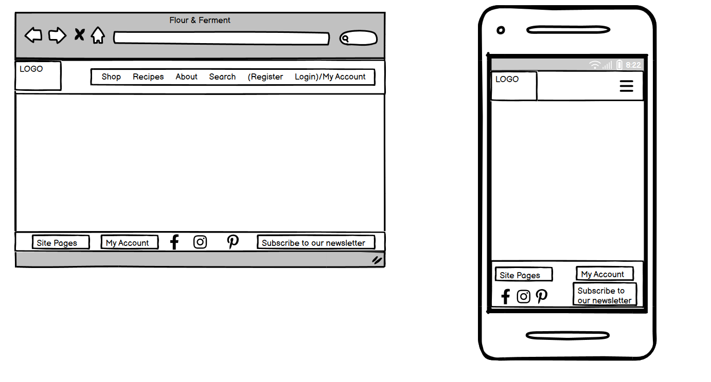

</details>

<details>

<summary>index.html - desktop </summary>

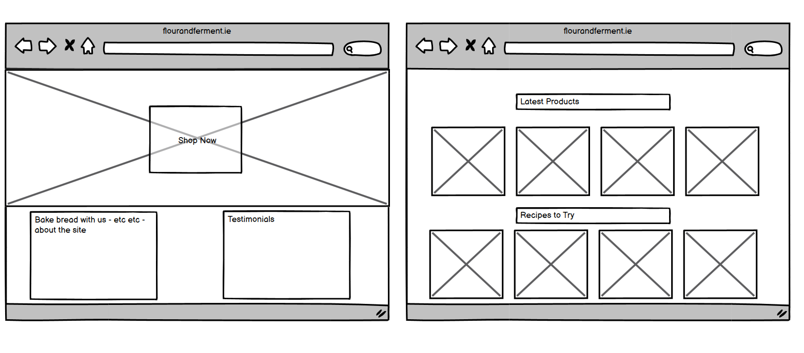

</details>

<details>

<summary>index.html - mobile </summary>

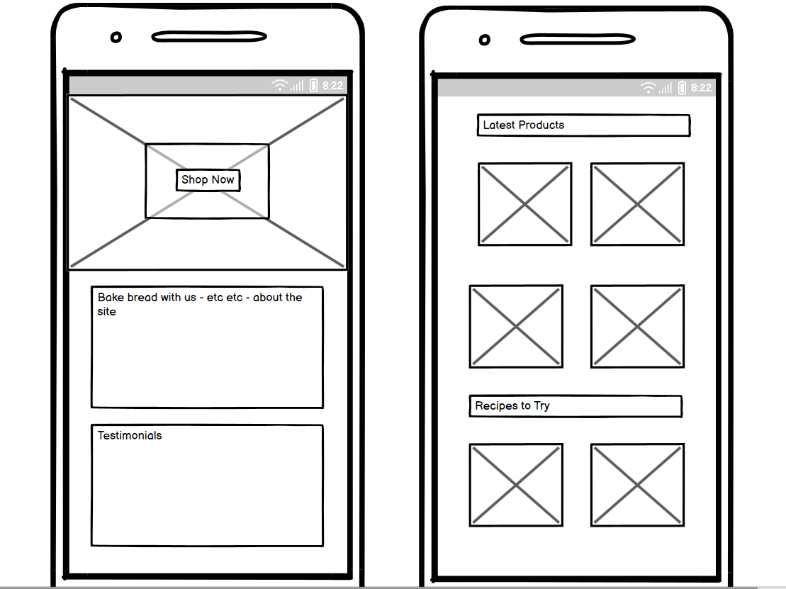

</details>

<details>

<summary>product_list.html - desktop and mobile </summary>

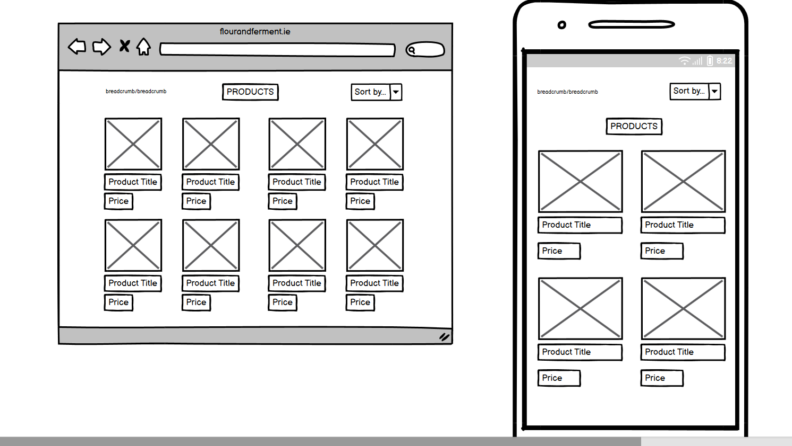

</details>

<details>

<summary>product_detail.html - desktop and mobile</summary>

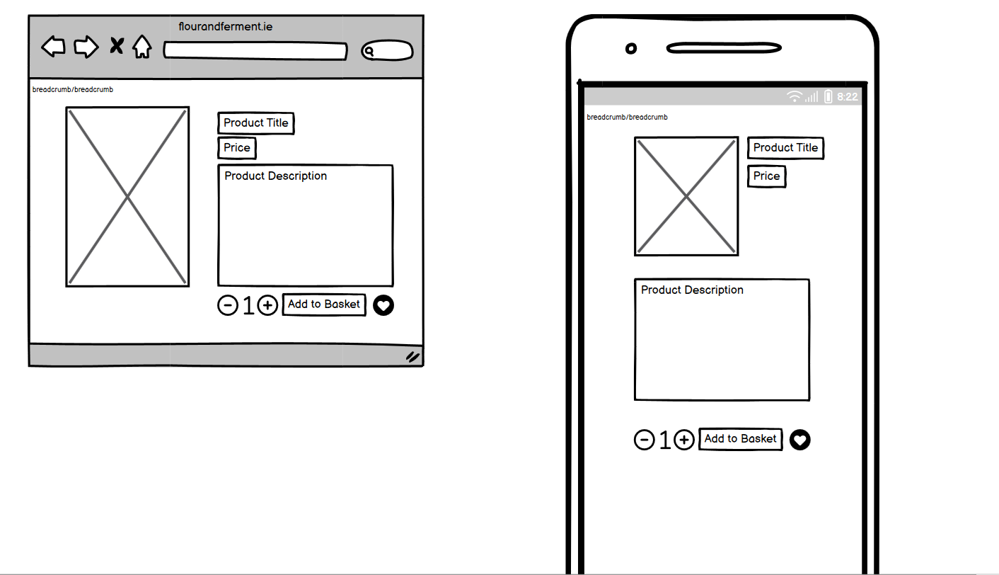

</details>

<details>

<summary>user_profile.html - desktop and mobile</summary>

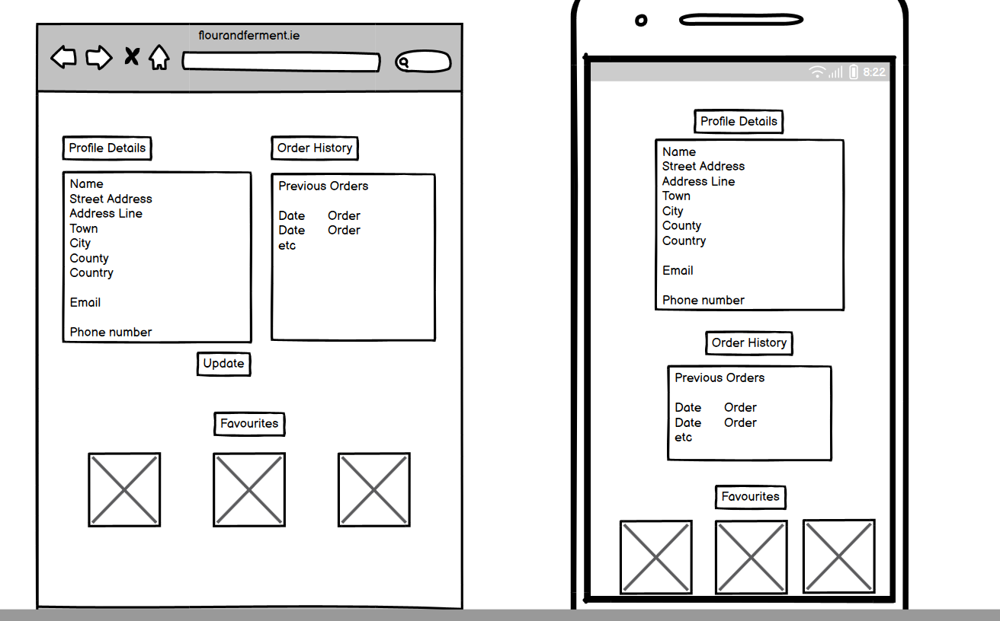

</details>


#### Database Design

While planning this project, I drew up an Entity Relationship Diagram to help me to visualise the database models and their relationships.

##### Database Evolution

The initial Entity Relationship Diagram (ERD) was created during the planning phase to represent the anticipated relationships between the models. However, as development progressed, certain requirements and challenges emerged that led to changes in the database structure. This is a common aspect of Agile development, allowing flexibility to adapt to new insights.

<details>

<summary> Current ERD  </summary>
  
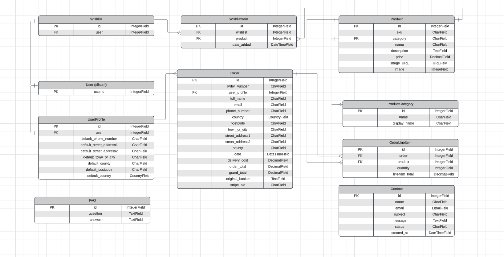

</details>

<details>

<summary> Original ERD </summary>

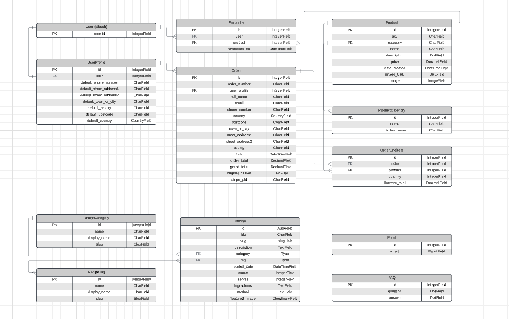

</details>


#### Colour Scheme

The website's colour scheme is designed to evoke a sense of **warmth, sophistication, and natural elegance**, aligning with the artisanal and hand-crafted nature of sourdough bread.

##### **Primary Colors**
- **Syracuse Red Orange (#C7500D)** – A bold, warm accent color that adds vibrancy and contrast, ideal for calls-to-action and key elements.
- **Eerie Black (#1F1E1E)** – A deep, rich black used for text and essential components, ensuring readability and strong visual impact.

##### **Neutral & Supporting Colors**
- **White (#FEFDFB)** – A clean, crisp white that maintains a light and airy aesthetic.
- **Silver (#A7A9A5)** – A subtle gray tone used for backgrounds and secondary elements, adding a modern touch.
- **Beaver (#988671)** – A soft, earthy brown that provides a warm, natural foundation for the design.
- **Taupe (#3B342B)** – A muted, deep brown that enhances depth and contrast while maintaining a grounded, organic feel.

Together, this palette creates a **balanced, inviting, and high-contrast visual experience** that reflects both **craftsmanship and authenticity**.

The colour palette was created using [Coolors](https://coolors.co/).

<details>

<summary> Colour Palette  </summary>

  


</details>


#### Fonts
  
The following [Google Fonts](https://fonts.google.com/) fonts were chosen to create a **modern, elegant, and highly readable** user experience.

- **Playfair Display**: A sophisticated serif font with a **classic yet contemporary** feel, used for headings and key display text. Its high contrast and refined letterforms add a touch of **elegance and professionalism** to the site's design.
  
- **Merriweather**: A highly readable serif font designed for **comfortable, long-form reading**, used for body text and general content. Its **balanced proportions and slightly condensed style** ensure clarity across all screen sizes.

Together, these fonts create a **harmonious blend of elegance and readability**, reinforcing the site's aesthetic while maintaining usability.


#### Imagery

- All images used for products were taken from various e-commerce stores.
- Hero image: Photo from <a href="https://brodandtaylor.com/blogs/recipes/sourdough-starter-from-creation-to-maintenance">Brod & Taylor website</a>.
- Favicon was created using <a href="https://favicon.io">favicon.io</a>

  <details>

  <summary>Favicon</summary>
    
  

  </details>

---

## Features

### General Features

This website provides a seamless and user-friendly experience for purchasing sourdough baking supplies. Below are the key features that enhance usability and functionality:

#### Navigation

- **Responsive Navigation Bar**: The site features a fixed-top navbar with dropdown menus for easy access to products and site pages.
- **Search Functionality**: Users can search for products using a search bar located in the navbar.

<details>

<summary> Details </summary>

It includes links to the following pages:
- Home (by clicking on the app logo)
- Our Story, FAQ and Contact (dropdown menu from About)
- Login/Register (logged out users)
- My Profile, My Wishlist and Logout (dropdown menu from Account - logged in users only)
- Admin, Add New Product, Edit/Delete A Produt (dropdown menu from Admin - admin users only)

It also includes:
- a search bar 
- a shopping basket icon with the total price of the contents of the user's basket

**Key Features**:
- Fixed to the top of the screen in all views to allow for easy navigation.
- Adjusts automatically for different screen sizes.
- On smaller screens, it collapses into a dropdown toggler for a cleaner and more user-friendly interface.

**Screenshots**:


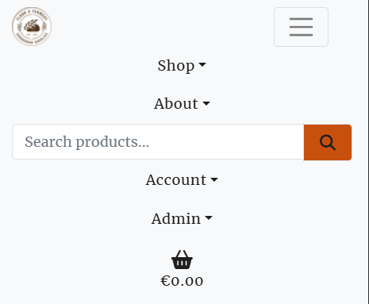

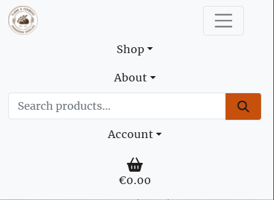


</details>


---

#### Footer
The site displays a footer on all pages which is fully responsive at all screen sizes. It provides essential navigation and engagement options for users. It is structured into different sections for easy accessibility.

<details>

<summary> Details </summary>

Navigation Links
- **Site Pages**: Quick links to key pages including Home, Shop, Our Story, FAQ, and Contact.
- **Account Links**: Options for users to register or log in to their account (logged-out users) or access their profile, wishlist or logout (logged-in users)

Social Media
- **Follow Us**: Links to social media platforms such as Facebook, X (Twitter), Instagram, and YouTube.
- **Icons**: Social media icons are displayed for quick recognition.

Newsletter Subscription
- **Call to Action**: Users are encouraged to subscribe for exclusive offers.
- **Email Input**: A simple form is provided via MailChimp for users to enter their email and subscribe.
- **Styled Button**: A visually distinct "Subscribe" button for engagement.

Legal & Branding
- **Copyright Notice**: Displays the current year and company name.
- **Privacy Policy**: A link to the site's privacy policy.

**Screenshots**:
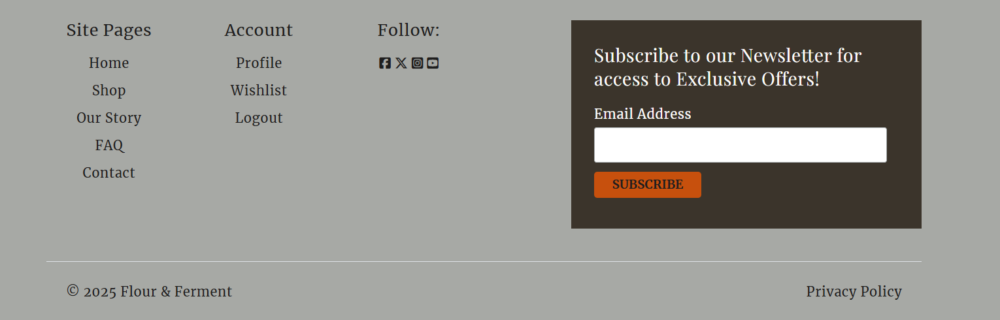
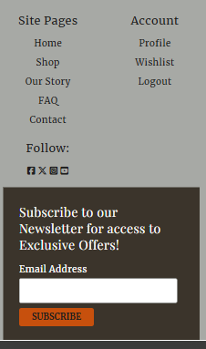

</details>

---

### Shop 

The **Shop** allows users to browse all available products, filter by categories, and sort items based on price, name, and category.

#### Key Features:
- **Category Selection**: Users can browse by category using category badges.
- **Search & Sorting**: A search bar and sorting dropdown help users find products easily.
- **Product Grid**: Displays products with images, prices, and quick access to product details.
- **Admin Controls**: Admin users can edit or delete products directly from the shop page.

#### Product Cards:
- **Product Image & Name**: Clicking on an image or name redirects users to the product detail page.
- **Price Display**: Clear product pricing with currency formatting.
- **Category Links**: Products are linked to their respective categories for easy navigation.

<details>

<summary> Screenshots </summary>


</details>

---

#### Product Detail Page

The **Product Detail Page** provides an in-depth look at each product, including descriptions, images, and purchase options.

##### Key Features:
- **High-Quality Product Images**: Clickable images allow users to view the full-size product image.
- **Detailed Description**: Displays product information, price, and category.
- **Add to Basket**: Users can specify a quantity and add the product to their basket.
- **Wishlist Integration**: Logged-in users can add the product to their wishlist.
- **Admin Controls**: Superusers can edit or delete products from this page.
- **Related Products**: The page suggests similar products that users might be interested in.
- **Quick Navigation**: Users can return to the shop page or continue shopping with ease.

<details>

<summary> Screenshots </summary>


</details>

---


#### Shopping Basket
- **Add to Basket**: Items can be easily added to the basket from product pages.
- **Basket Overview**: Users can view their basket summary, including item quantities and total cost.
- **Update & Remove Items**: Items can be adjusted or removed from the basket before proceeding to checkout.

**Screenshots**:


---

#### Checkout Process
- **Secure Checkout**: The site integrates Stripe for secure payments.
- **Order Summary**: Users receive a breakdown of their purchase before confirming payment.
- **Order Confirmation**: A confirmation page is displayed upon successful purchase.


---

### **Search & Filtering**

#### **Search Products**
Users can search for products by keywords in their title or description.

<details>

<summary> Details </summary>

**Key Features**:
- A search box available in the navigation bar on all pages.
- Results dynamically update based on the search query.
- Message displays with search box underneath if no results for search query

**Screenshots**:

Search box Desktop:


Search results page for 'book':

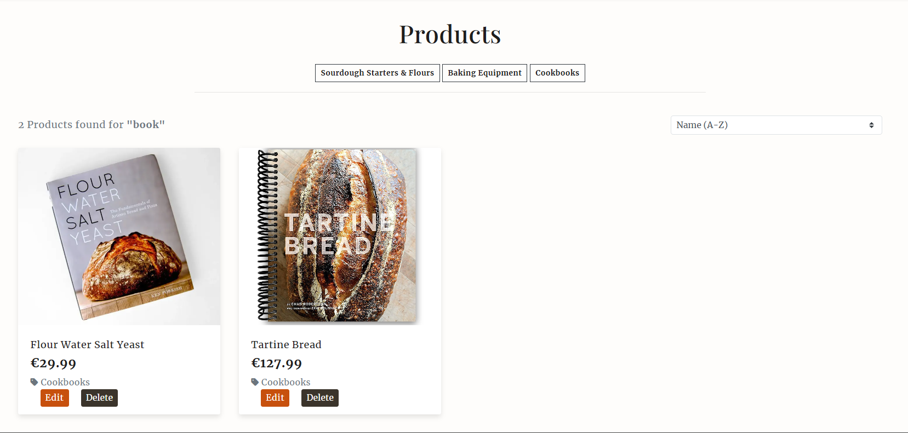

Zero search results:

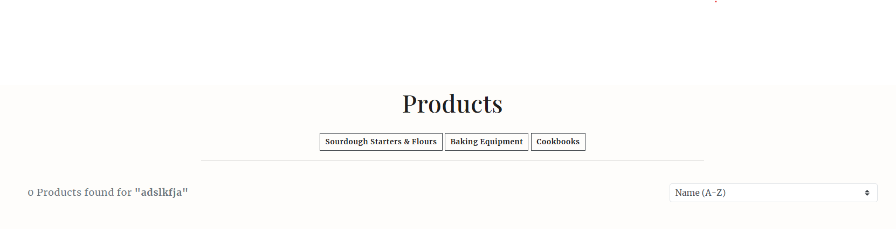

---

### **User Account Features**

#### **Registration**
Users can sign up for an account to access additional features such as viewing order history and saving products to a wishlist.

<details>

<summary> Details </summary>

**Key Features**:
- A registration form with fields for username, email, and password.
- Password validation to ensure security.

**Screenshots**:

Desktop:

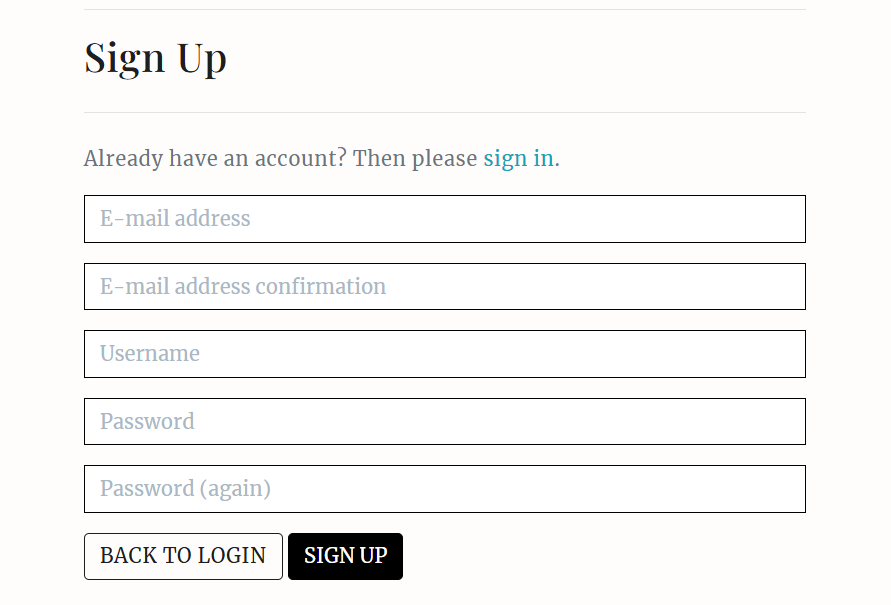

Mobile:

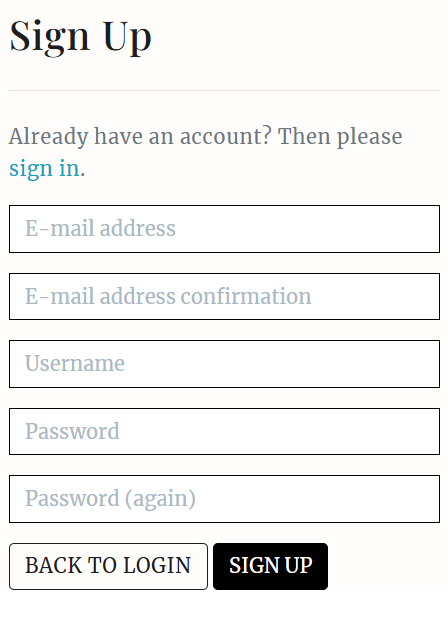

</details>


---

#### **Login/Logout**

Users can securely log in and out of their accounts to maintain session integrity.

<details>

<summary> Details </summary>

**Key Features**:

- Login form that authenticates users using their credentials.
- A logout option available in the Account dropdown menu in the navigation bar when logged in.
- Login status displayed in the top of the Account dropdown menu.
- Success messages displayed upon logging in or logging out.


**Screenshots**:

Login Form:

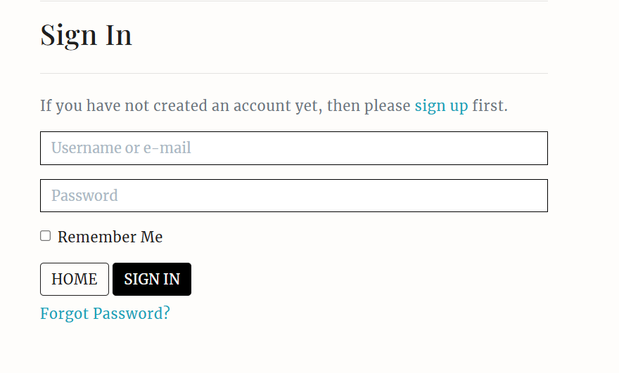

Logout Form:

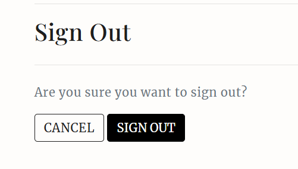

Logged-in Status:


Login Confirmation:
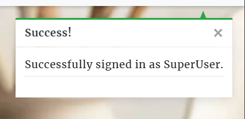

Logout Confirmation:
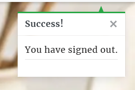


</details>

---

#### **User Authentication Error Handling**

The application provides comprehensive error handling for user authentication processes, ensuring users receive clear feedback when encountering issues during login or sign-up.

<details>

<summary> Details </summary>

**Key Features**:

- **Incorrect Password on Login**: Users are shown an error message if they enter an incorrect password while trying to log in, ensuring they understand the issue.
- **Nonexistent Username on Login**: If a user attempts to log in with a username that doesn't exist, they are informed via an error message, maintaining clarity and security.
- **Non-original Username on Sign Up**: During sign-up, users attempting to register with a username that already exists receive an error message, enforcing unique usernames.
- **Unmatching Passwords on Sign Up**: The "password" and "confirm password" fields must match during sign-up; otherwise, an error message is displayed.
- **Too Short Password on Sign Up**: Passwords are validated for minimum length, and users entering too-short passwords are informed with an error message to enhance security.
- **Invalid Email Address on Sign Up**: The email field checks for valid formatting, ensuring users cannot register with improperly formatted email addresses.

**Screenshots**:

- **Error for Incorrect Password and/or Nonexistent Username on Login**:
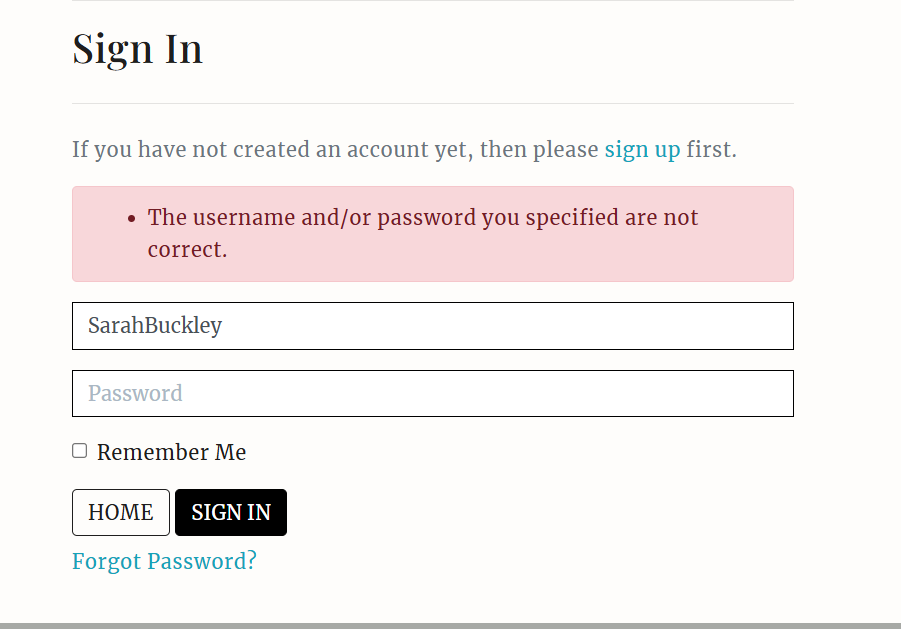

- **Error for Non-original Username on Sign Up**:
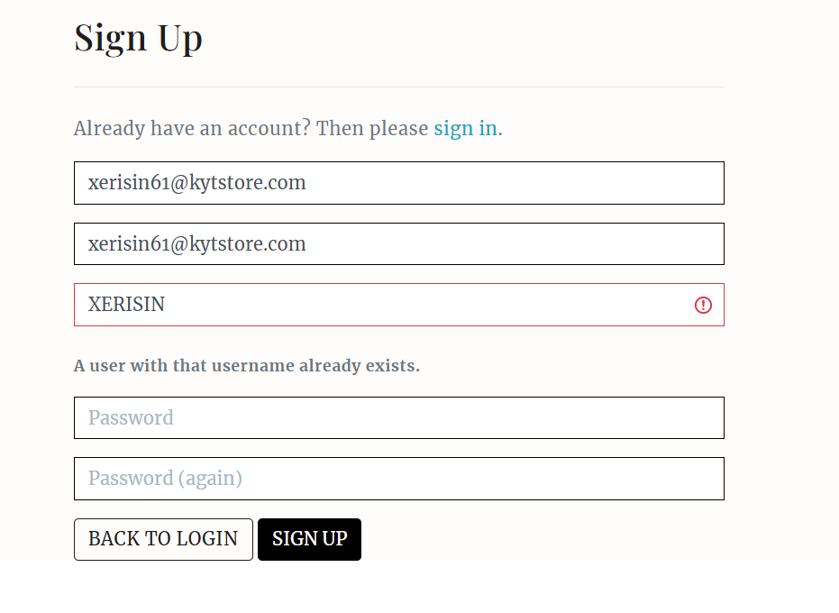

- **Error for Unmatching Passwords on Sign Up**:
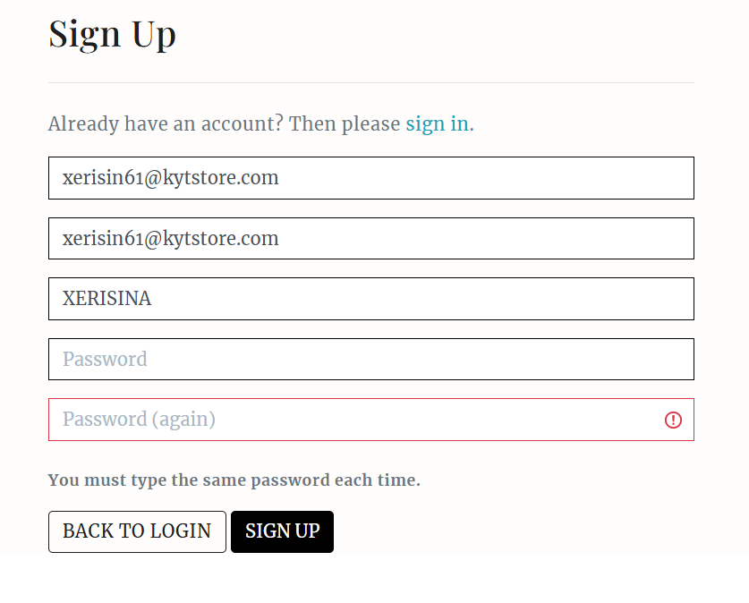

- **Error for Too Short Password on Sign Up**:
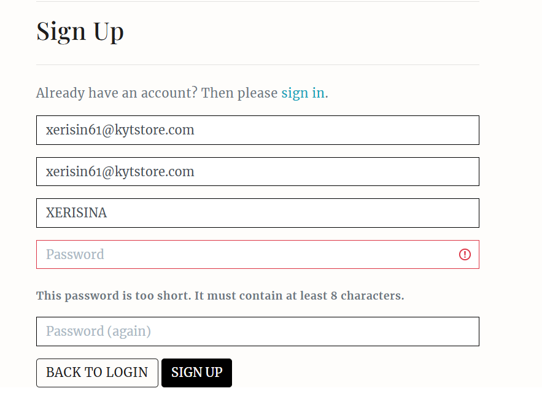

- **Error for Invalid Email Address on Sign Up**:
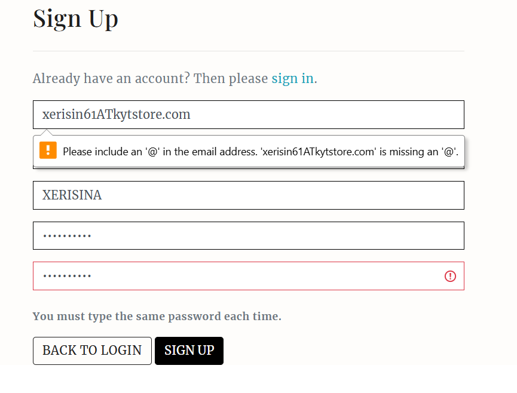

</details>

---


### **Admin/Staff-Specific Features**

#### **Admin Panel**
Admins can manage the site content directly from the Django admin panel.

<details>

<summary> Details </summary>

**Key Features**:
- Manage users, products, product categories, orders, faq, wishlists and queries.
- View and filter data using the admin interface.
- Bulk actions like deleting multiple products.

**Screenshots**:

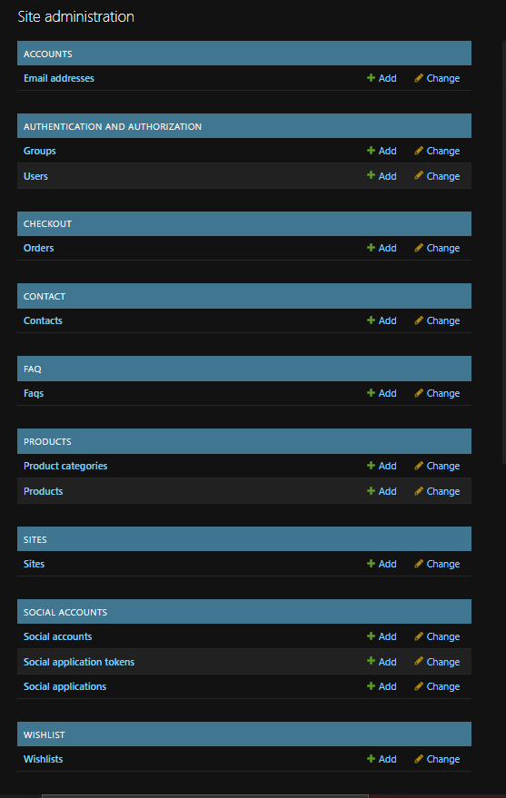

</details>

---

#### Product Management (Admin/Staff Only)
Staff and admin users can manage product listings directly from the site or the admin panel.

<details>

<summary> Details </summary>

**Key Features**:
- **Add Product**: Staff can create a new product with fields for SKU, Category, Name, Description, Price, Image URL and Image
- **Edit Product**: Staff can update any aspect of the product - accessed via Edit button on product on Products listing page or Edit icon on Product Detail page
- **Delete Product**: Staff can permanently delete a product - accessed via Delete button on product on Products listing page or Delete icon on Product Detail page

**Screenshots**:

- Add product Form: 


- Edit Product Form: 

This is the same as the form for creating a product, except that it is prepopulated with the product details.


- Delete Product Confirmation:

Before a staff/admin user deletes a product, via Edit button under the product image on the Products page, or the icon on the Product Detail page, a confirmation modal is displayed with the option to continue with deletion or to cancel the action.


</details>

----

### **About Menu Features**

#### **Our Story Page**
Users can view a dedicated page about the mission, services and community behind the site.

<details>

<summary> Details </summary>


**Screenshots**:


</details>


---

#### FAQ Page

The FAQ (Frequently Asked Questions) page provides quick and helpful answers to common customer inquiries.

<details>

<summary> Details </summary>


**Screenshots**:


</details>


#### Contact Page

The Contact page provides users with an easy way to reach out for inquiries, support, or feedback. 

##### Contact Form
- **User-Friendly Form**: Includes fields for name, email, subject, and message.
- **Validation**: Ensures required fields are filled before submission.
- **Submit Button**: Users can send their messages directly through the site.
- **Contact Success page**: A confirmation page is displayed after the message is sent successfully.

<details>

<summary> Details </summary>


**Screenshots**:


</details>

---

### **Account Menu Features**


#### **My Profile Page**

The **My Profile** page allows users to manage their personal details and access details of previous orders. 

<summary> Details </summary>

#### **Key Features**
- **Profile Information**: Users can view their registered name, email, and other personal details.
- **Update Profile Details**: Users can modify their contact information, such as email or address.
- **Order History**: A list of past purchases with order details, including date, status, and total amount.

**Screenshots**:


</details>


---

#### My Wishlist

Logged-in users can save items to their wishlist for future purchasing, via the heart icon on the product detail page.

Clicking on 'My Wishlist' displays the wishlist and items can be viewed and removed as needed.  Items can be quickly moved from the wishlist to the basket for easy purchase via the 'Add to Basket' button.

<details>

<summary> Details </summary>


**Screenshots**:


</details>

---


</details>

---
### Error Pages

#### Custom Error Pages

The app provides user-friendly custom error pages for HTTP errors including `403 Forbidden`, `404 Not Found`, `405 Method Not Allowed`, and `500 Internal Server Error`. This ensures users are presented with clear and aesthetically pleasing error messages, maintaining a professional look even when something goes wrong.

<details>

<summary> Details </summary>

- **403 Forbidden**:
  - Displayed when a user attempts to access a restricted page or perform an unauthorized action.
  - Message: "Sorry, you are not authorised to perform this action"
  
- **404 Not Found**:
  - Displayed when a user tries to access a page that does not exist.
  - Message: "Sorry, the page you are looking for does not exist."

- **405 Method Not Allowed**:
  - Displayed when a user tries to perform an HTTP method that is not supported by the server for a specific URL.
  - Message: "Sorry, the method you are trying to use is not allowed on this page."

- **500 Internal Server Error**:
  - Displayed when an unexpected error occurs on the server.
  - Message: "Something went wrong on our end. Please try again later."

Each error page includes:
- A **consistent site layout** to keep users oriented.
- A **clear message** explaining the error.
- A **call-to-action link**, the "Back Home" button, to help users navigate back to the main site.

- **404 Not Found**
  

- **500 Internal Server Error**
  

</details>

---


## Future Implementations

As the platform evolves, additional features and improvements may be introduced to enhance user experience, streamline operations, and expand functionality.


### **User Profiles & Authentication**
- Allowing users to update their passwords for enhanced security.

### **Content & Recipes**
- Introducing a dedicated recipe section with categorized listings and detailed recipe pages.
- Implementing a tagging system for recipes to improve discoverability.
- Adding search functionality for recipes to allow users to find relevant content quickly.

---
  
## Project Management & Agile Methodologies

### Agile Development

This project was developed using Agile methodology which allowed me to iteratively and incrementally build my app, with flexibility to make changes to my design throughout the entire development process.


#### Kanban Board

GitHub Issues and Projects were used to manage the development process. Each part of the app is divided into Epics which are broken down into User Stories with Tasks. An Epic represents a large body of work, such as a feature. 

<details>

<summary> Epics and User Stories screenshot </summary>

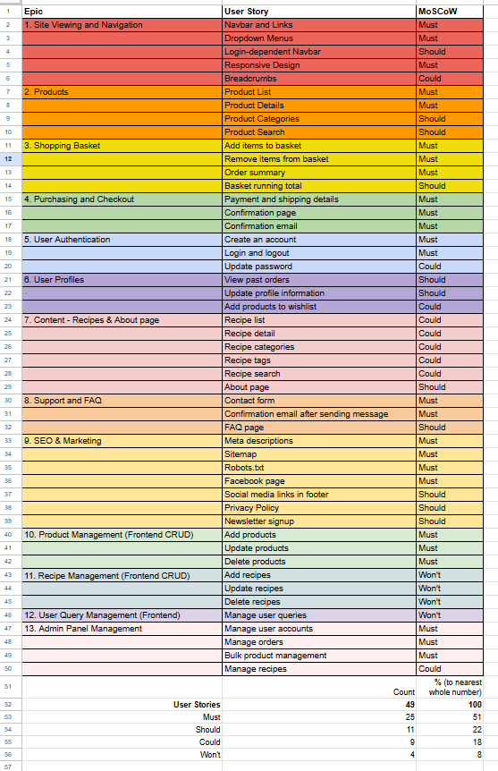

</details>

[Link to original document](https://docs.google.com/spreadsheets/d/1DywOsRNp3SZfBRsrRaIck3M5WMe0I2QfKYrEEFMTcZw/edit?usp=sharing)


The board view of the Project feature was used to display and manage my progress in the form of a 'kanban board'. The user stories were added to the 'Todo' column to be prioritised for development, moved to the 'In Progress' column to indicate development of the feature had begun and finally moved to the 'Done' column when the feature had been implemented and the acceptance criteria had been met.

I also added a 'Future Additions' column to keep track of user stories that were left out of this iteration but could be implemented in future iterations.

<details>

  <summary> Kanban Board  </summary>

  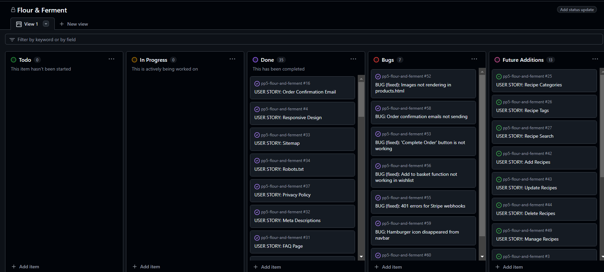

</details>

[The Project Kanban Board](https://github.com/users/EJFleet/projects/3)

#### MoSCoW Prioritisation

User stories were prioritised using the MoSCoW prioritisation technique. Each user story was given one of the following labels:

1. **Must Have** – Critical requirements that are essential for the project’s success.
2. **Should Have** – Important but not critical; can be deferred if necessary.
3. **Could Have** – Desirable but not necessary; included if time/resources allow.
4. **Won't Have** – Not planned for this phase; may be considered in the future.


##### How My Prioritization Aligns with MoSCoW Guidelines
For this project, I carefully categorized **49 user stories** using the MoSCoW method, ensuring a balance between essential and flexible requirements:

| Priority | Count | Percentage |
|----------|------|------------|
| **Must Have** | 25 | 51% |
| **Should Have** | 11 | 22% |
| **Could Have** | 9 | 18% |
| **Won't Have** | 4 | 8% |

### Staying Within MoSCoW Guidelines
Industry best practices suggest that:
- **Must-Have items** should comprise around **50-60%** of total requirements to maintain project feasibility.
- **Should-Have and Could-Have features** should make up around **30-40%**, allowing flexibility.
- **Won't-Have items** should be clearly identified to prevent scope creep.

My prioritization follows these principles:
- **Must-Haves** account for **51%**, ensuring a strong foundation.  
- **Should-Haves and Could-Haves** together make up **40%**, maintaining flexibility.  
- **Won't-Haves** are **under 10%**, clarifying what is out of scope.  

By adhering to this structured approach, I ensure that the core features are delivered while allowing room for enhancements if time and resources permit.

---

## Technologies Used


### Languages

- [HTML5](https://en.wikipedia.org/wiki/HTML5)
- [CSS3](https://en.wikipedia.org/wiki/CSS)
- [JavaScript](https://en.wikipedia.org/wiki/JavaScript)
- [Python](https://en.wikipedia.org/wiki/Python_(programming_language))


### Frameworks, Libraries & Packages

### Frameworks, Libraries & Packages  

- [boto3 1.36.23](https://boto3.amazonaws.com/v1/documentation/api/latest/index.html) - Amazon Web Services (AWS) SDK for Python, used for managing S3 file storage.
- [Bootstrap 4](https://getbootstrap.com/) - front-end CSS framework for modern responsiveness and pre-built components.
- [Django 4.2.8](https://docs.djangoproject.com/en/4.2/) - The main web framework used to build the application, providing models, views, and template functionality.
- [django-allauth 0.54.0](https://django-allauth.readthedocs.io/en/latest/) - Handles authentication, registration, and account management for users.
- [django-countries 7.1](https://github.com/SmileyChris/django-countries) - Provides a country field for Django models.
- [django-crispy-forms 1.14.0](https://django-crispy-forms.readthedocs.io/en/latest/) - Enhances form rendering with Bootstrap compatibility.
- [django-storages 1.14.5](https://django-storages.readthedocs.io/en/latest/) - Facilitates media and static file storage using cloud services.
- [dj-database-url 0.5.0](https://pypi.org/project/dj-database-url/) - Simplifies database configuration using environment variables.
- [Gunicorn 23.0.0](https://gunicorn.org/) - A WSGI HTTP server for running the Django application in production.
- [pillow 11.1.0](https://pillow.readthedocs.io/en/stable/) - Python Imaging Library for handling image files.
- [psycopg2 2.9.10](https://pypi.org/project/psycopg2/) - PostgreSQL database adapter for Python, enabling Django to interact with PostgreSQL.
- [stripe 11.5.0](https://stripe.com/docs/api) - Payment processing API used for secure transactions.
- [wheel 0.45.1](https://pypi.org/project/wheel/) - A built-package format for Python.

This combination of frameworks and libraries ensures a **secure, scalable, and efficient** e-commerce experience for Flour & Ferment.


### Tools

- [Am I Responsive](https://ui.dev/amiresponsive) - Responsive screenshots and testing for multiple device views.
- [Balsamiq](https://balsamiq.com/) - Wireframing tool used for planning the UI design.
- [ChatGPT](https://chatgpt.com/) - Used for debugging and formatting.
- [Chrome DevTools](https://developer.chrome.com/docs/devtools/) - Developer tools for inspecting, debugging, and optimizing web applications.
- [Code Insitute PEP8 Validator](https://pep8ci.herokuapp.com/#) - Python code validation tool.
- [Coolors](https://coolors.co/) - Color palette generator for UI design.
- [Django Secret Key Generator](https://djecrety.ir/) - Generates secure Django secret keys.
- [favicon.io](https://favicon.io/) - Online tool for generating favicons.
- [Font Awesome 5.15.4](https://fontawesome.com/) - Provides scalable vector icons and social media icons.
- [Git](https://git-scm.com/) - Version control system for managing code changes.
- [GitHub](https://github.com/) - Cloud-based repository hosting service.
- [Google Fonts](https://fonts.google.com/) - Online font library used in the application.
- [Heroku](https://heroku.com/) - Cloud platform for deploying web applications.
- [JSHint](https://jshint.com/) - JavaScript code validation tool.
- [Lucid.app](https://lucid.app) - Tool for creating Entity Relationship Diagrams (ERDs).
- [PostgreSQL](https://www.postgresql.org/) - Open-source relational database management system.
- [Shields.io](https://shields.io/) - Generates badges for README files.
- [The W3C CSS Validation Service](https://jigsaw.w3.org/css-validator/) - Validates CSS stylesheets.
- [The W3C Markup Validation Service](https://validator.w3.org/) - Validates HTML documents.


##  Deployment & Local Development    

## Deployment

The live deployed application can be found on [Heroku](https://pp5-ci-flour-and-ferment-b9db037d992a.herokuapp.com/).


### **Setting Up a PostgreSQL Database**

For deploying this project, we use **PostgreSQL**, a powerful, open-source relational database system. Follow these steps to create and connect your PostgreSQL database to your Heroku application.

#### **Step 1: Create a PostgreSQL Database**
If you don’t already have a PostgreSQL instance, you can set one up using a cloud database provider like **ElephantSQL**. Here’s how to create one with **ElephantSQL** (other providers may have similar steps):

1. Navigate to [ElephantSQL](https://www.elephantsql.com/).
2. Click **Create New Instance**.
3. Provide a name for your database (e.g., `flour-and-ferment-db`).
4. Choose the **Tiny Turtle (Free)** plan if available, or another suitable plan.
5. Select a **Region** closest to your users for optimal performance.
6. Click **Create Instance**.
7. Once created, go to your **Instance Details** to find the **Database URL**.

#### **Step 2: Connect PostgreSQL to Your Heroku App**
Now that we have a database, we need to link it to **Heroku**:

1. Log in to **Heroku** and navigate to your project dashboard.
2. Click **Settings** → **Reveal Config Vars**.
3. Add a new environment variable:
   - **Key:** `DATABASE_URL`
   - **Value:** Paste your **Database URL** from ElephantSQL.

#### **Step 3: Apply Database Migrations**
Once the database is connected, run the following commands in your terminal to set up your schema:

```sh
python3 manage.py makemigrations
python3 manage.py migrate
```

#### **Step 4: Set Up a Superuser (Optional, but Recommended)**
If your project has an **admin panel**, create a superuser for managing data:

```sh
python3 manage.py createsuperuser
```
Follow the prompts to set up login credentials.

#### **Step 5: Deploy and Test Connection**
1. Ensure your `requirements.txt` includes **psycopg2**:
   ```sh
   pip3 freeze --local > requirements.txt
   ```
2. Deploy changes to Heroku:
   ```sh
   git add .
   git commit -m "Connected PostgreSQL database"
   git push heroku main
   ```
3. Test that your site is loading data from PostgreSQL correctly.

---

Your PostgreSQL database is now set up and fully connected to your Heroku app!

##### **Appendix: Code Institute PostgreSQL Database Setup**

If you are a **Code Institute student**, you may use the Code Institute-hosted PostgreSQL database instead of setting up your own.

###### **Steps to Set Up**
1. Create an account at **[Code Institute PostgreSQL](https://dbs.ci-dbs.net/manage/KeeMR5RVAMT6WX8k/)**.
2. Click **Create New Instance**.
3. Copy the **Database URL** provided.
4. In **Heroku**, navigate to **Settings → Reveal Config Vars**.
5. Add a new environment variable:
   - **Key:** `DATABASE_URL`
   - **Value:** Paste your **Code Institute PostgreSQL URL**.
6. Run migrations to apply the database schema:
   ```sh
   python3 manage.py makemigrations
   python3 manage.py migrate
7. Optionally, create a superuser for admin access:
  ```sh
  python manage.py createsuperuser
  ```
8. Your database is now ready to use.

--- 

---

### AWS S3 Setup (Static Hosting)

#### **Step 1 - Create an S3 Bucket**
1. Log in to your AWS account and navigate to the AWS dashboard.
2. To access S3, either:
   - Click on the **S3** service directly, or
   - Type **“S3”** in the search bar and click on **S3**.
3. Click **Create bucket**.
4. Configure the new bucket:
   - **Enter a bucket name** (must be globally unique).
   - **Select** ‘ACLs enabled’.
   - **Choose** ‘Bucket owner preferred’.
   - **Deselect** ‘Block all public access’.
   - **Check the box** acknowledging the risk of public access.
   - Leave other settings unchanged and click **Create bucket**.

#### **Step 2 - Enable Static Website Hosting**
1. Once the bucket is created, click on its name to access its details.
2. Click on the **Properties** tab.
3. Scroll down to **Static website hosting** and click **Edit**.
4. Configure the settings:
   - **Enable** Static website hosting.
   - Set **Index document** to `index.html`.
   - Set **Error document** to `error.html`.
   - Click **Save changes**.

#### **Step 3 - Configure CORS (Cross-Origin Resource Sharing)**
1. Go to the **Permissions** tab.
2. Scroll down to **Cross-origin resource sharing (CORS)** and click **Edit**.
3. Add the following JSON code:

```json
[
  {
    "AllowedHeaders": ["Authorization"],
    "AllowedMethods": ["GET"],
    "AllowedOrigins": ["*"],
    "ExposeHeaders": []
  }
]
```

4. Click **Save changes**.

#### **Step 4 - Add a Bucket Policy**
1. On the **Permissions** tab, scroll to **Bucket policy** and click **Edit**.
2. Click **Policy Generator** (opens in a new tab).
3. In the Policy Generator:
   - Select **S3 Bucket Policy**.
   - For **Principal**, enter `"*"` (without quotes).
   - For **Action**, select `GetObject`.
   - Copy your bucket’s **ARN** from the bucket policy editor in the other tab and paste it into the ARN field in the Policy Generator.
   - Click **Add Statement**.
   - Scroll down and click **Generate Policy**.
   - Copy the generated policy from the pop-up.
4. Return to the **Bucket policy editor** and paste in the policy.
5. Modify the **Resource** field to include `/*` at the end, allowing access to all objects:

```json
{
  "Version": "2012-10-17",
  "Id": "PolicyGenerated",
  "Statement": [
    {
      "Sid": "PublicReadGetObject",
      "Effect": "Allow",
      "Principal": "*",
      "Action": "s3:GetObject",
      "Resource": "YOUR_ARN/*"
    }
  ]
}
```

6. Click **Save changes**.

#### **Step 5 - Edit the Access Control List (ACL)**
1. On the **Permissions** tab, scroll down to **Access control list (ACL)** and click **Edit**.
On the 'Edit Access control list' page:
2. Under **Everyone (public access)**, check the **List** permission.
3. Check the box to acknowledge the risk.
4. Click **Save changes**.

---
Your AWS S3 bucket is now configured for **public static website hosting**.

---

### AWS IAM Setup (Groups, Policies, and Users)

#### **Step 1 - Create a User Group**
1. Search for **‘IAM’** in the AWS search bar.
2. Click on **IAM**.
3. In the left menu, click **User Groups**.
4. Click **Create Group**.
5. Enter a **group name** (e.g., related to your bucket, such as `manage-my-bucket`).
6. Scroll to the bottom and click **Create user group**.

#### **Step 2 - Create a Policy**
1. In the left menu, click **Policies**.
2. Click **Create Policy**.
3. Click the **JSON** tab.
4. Click **Actions** → **Import policy**.
5. Search for **‘s3’**.
6. Select **AmazonS3FullAccess**.
7. Click **Import Policy**.

##### **Add Your ARN to the Policy**
1. Open a new tab, search for **‘S3’**, and open the **S3 service**.
2. Select your bucket.
3. Click **Copy ARN**.
4. Go back to the policy editor and replace `YOUR_ARN` with your actual ARN.
5. Modify the **Resource** section as follows:

```json
{
  "Version": "2012-10-17",
  "Statement": [
    {
      "Sid": "Statement1",
      "Effect": "Allow",
      "Action": [
        "s3:*"
      ],
      "Resource": [
        "YOUR_ARN",
        "YOUR_ARN/*"
      ]
    }
  ]
}
```

6. Scroll down and click **Next**.
7. Enter a **policy name** and description.
8. Scroll down and click **Create policy**.
9. You should see a success message confirming the policy has been created.

#### **Step 3 - Attach the Policy to the Group**
1. In the left menu, click **User Groups**.
2. Click on your group.
3. Click the **Permissions** tab.
4. Click the **Add permissions** dropdown.
5. Select **Attach policies**.
6. Search for the policy you just created (by name or description).
7. Select the checkbox next to the policy.
8. Click **Attach policies**.

#### **Step 4 - Create a User**
1. In the left menu, click **Users**.
2. Click **Create User**.
3. Enter a **username**.
4. Click **Next**.
5. Select the **group** you created earlier.
6. Click **Next**.
7. Scroll down and click **Create User**.

#### **Step 5 - Create an Access Key**
1. Click on your newly created user.
2. Click the **Security Credentials** tab.
3. Scroll to the **Access Keys** section and click **Create access key**.
4. Select **Application running outside AWS**.
5. Click **Next**.
6. Click **Create access key**.
7. Download the **.csv file**.
8. Click **Done**.
9. Open the `.csv` file in a text editor (e.g., Notepad or TextEdit). The values inside will be separated by commas.
10. Use these values as your **AWS_ACCESS_KEY_ID** and **AWS_SECRET_ACCESS_KEY** in your **Heroku config vars** or `.env` file.

---
Your AWS IAM setup is now complete!

---

## Stripe API

This project uses [Stripe](https://stripe.com) to handle ecommerce payments.

### **Step 1: Get Your API Keys**
Once you've created a **Stripe account** and logged in, follow these steps to connect your project:

1. In your **Stripe Dashboard**, click **Developers** → **API Keys**.
2. Expand **"Get your test API keys"** to see your keys:
   - `STRIPE_PUBLIC_KEY` = **Publishable Key** (starts with **pk_**).
   - `STRIPE_SECRET_KEY` = **Secret Key** (starts with **sk_**).
3. Copy these keys and add them to your **Heroku Config Vars**:
   - Navigate to **Settings** → **Reveal Config Vars** in Heroku.
   - Add the following variables:
   ```sh
   STRIPE_PUBLIC_KEY=<your-publishable-key>
   STRIPE_SECRET_KEY=<your-secret-key>
   ```

---

### **Step 2: Set Up Webhooks**
To ensure payments are properly recorded, you need to **set up Stripe Webhooks**.

1. In your **Stripe Dashboard**, click **Developers** → **Webhooks**.
2. Click **+ Add Endpoint**.
3. **Enter your webhook URL**:
   ```sh
   https://your-deployed-site.herokuapp.com/checkout/wh/
   ```
   - **Important**: Ensure the URL **ends with a slash (`/`)**, or the webhook will fail.
4. Click **+ Select events**.
5. Choose **"Receive all events"**.
6. Click **Add Events**, then **Add Endpoint**.
7. In the newly created webhook, click **Reveal Signing Secret**.
8. Copy the key that starts with **wh_** and add it to your **Heroku Config Vars**:
   ```sh
   STRIPE_WH_SECRET=<your-signing-secret>
   ```

---


### Gmail API
This project uses [Gmail](https://mail.google.com) to handle sending emails to users for account verification and purchase order confirmations.

Once you've created a Gmail (Google) account and logged-in, follow these series of steps to get your project connected.

- Click on the **Account Settings** (cog icon) in the top-right corner of Gmail.
- Click on the **Accounts and Import** tab.
- Within the section called "Change account settings", click on the link for **Other Google Account settings**.
- From this new page, select **Security** on the left.
- Select **2-Step Verification** to turn it on. (verify your password and account)
- Once verified, select **Turn On** for 2FA.
- Navigate back to the **Security** page, and you'll see a new option called **App passwords**.
- This might prompt you once again to confirm your password and account.
- Select **Mail** for the app type.
- Select **Other (Custom name)** for the device type.
	- Any custom name, such as "Django" or flour-and-ferment
- You'll be provided with a 16-character password (API key).
	- Save this somewhere locally, as you cannot access this key again later!
	- `EMAIL_HOST_PASS` = user's 16-character API key
	- `EMAIL_HOST_USER` = user's own personal Gmail email address


### **Heroku Deployment**
This project is deployed on **Heroku**, a platform-as-a-service (PaaS) that enables developers to build, run, and operate applications entirely in the cloud.

#### **Step 1: Create a Heroku App**
1. Log in to [Heroku](https://www.heroku.com/) and navigate to your **Heroku Dashboard**.
2. Click **New** → **Create new app**.
3. Enter a **unique app name**.
4. Choose a **region** closest to your users (EU or USA).
5. Click **Create App**.

#### **Step 2: Configure Heroku Environment Variables**
Heroku requires several **environment variables** to function properly. Add these by:
1. Navigating to **Settings** → **Reveal Config Vars**.
2. Adding the following key-value pairs:

| Key                 | Value (Replace with your own) |
|---------------------|----------------------------------|
| `DATABASE_URL`      | PostgreSQL database URL |
| `DISABLE_COLLECTSTATIC` | 1 (*temporary, remove before final deployment*) |
| `EMAIL_HOST_PASS`   | Your Gmail API key |
| `EMAIL_HOST_USER`   | Your Gmail email address |
| `SECRET_KEY`        | Your Django secret key |
| `STRIPE_PUBLIC_KEY` | Your Stripe public key |
| `STRIPE_SECRET_KEY` | Your Stripe secret key |
| `STRIPE_WH_SECRET`  | Your Stripe webhook secret |

#### **Step 3: Install Required Packages**
Ensure that all required dependencies are installed before deployment:
```sh
pip3 install -r requirements.txt
```
If you have installed new packages, update the `requirements.txt` file:
```sh
pip3 freeze --local > requirements.txt
```

#### **Step 4: Set Up the Procfile**
Heroku requires a **Procfile** to run the application. Create one using:
```sh
echo web: gunicorn app_name.wsgi > Procfile
```
*(Replace `app_name` with your Django project's main app where `settings.py` is located.)*

#### **Step 5: Deploy to Heroku**
You can deploy your project in one of two ways:

##### **Option 1: Deploy via Heroku GitHub Integration**
1. In **Heroku Dashboard**, go to **Deploy**.
2. Connect your app to **GitHub**.
3. Select the correct **GitHub repository**.
4. Enable **Automatic Deploys** (recommended).
5. Click **Deploy Branch**.

##### **Option 2: Deploy via Command Line**
1. Log into Heroku:
   ```sh
   heroku login -i
   ```
2. Set the Heroku remote repository:
   ```sh
   heroku git:remote -a your-heroku-app-name
   ```
3. Deploy the app:
   ```sh
   git add .
   git commit -m "Deploying to Heroku"
   git push heroku main
   ```

#### **Step 6: Migrate Database & Create Superuser**
Once the app is deployed, run these commands to set up the database:
```sh
heroku run python3 manage.py migrate
heroku run python3 manage.py createsuperuser
```

#### **Step 7: Finalize Deployment**
1. Remove the `DISABLE_COLLECTSTATIC` variable from Heroku Config Vars.
2. Restart dynos to apply changes.
3. Test the application by visiting your **Heroku app URL**.

Your project is now successfully deployed on Heroku! 🚀

---

### Local Deployment
This project can be cloned or forked in order to make a local copy on your own system.

For either method, you will need to install any applicable packages found within the *requirements.txt* file.

- `pip3 install -r requirements.txt`.

You will need to create a new file called `env.py` at the root-level,
and include the same environment variables listed above from the Heroku deployment steps.

Sample `env.py` file:

```python
import os

os.environ.setdefault("DATABASE_URL", "user's own value")
os.environ.setdefault("EMAIL_HOST_PASS", "user's own value")
os.environ.setdefault("EMAIL_HOST_USER", "user's own value")
os.environ.setdefault("SECRET_KEY", "user's own value")
os.environ.setdefault("STRIPE_PUBLIC_KEY", "user's own value")
os.environ.setdefault("STRIPE_SECRET_KEY", "user's own value")
os.environ.setdefault("STRIPE_WH_SECRET", "user's own value")

# local environment only (do not include these in production/deployment!)
os.environ.setdefault("DEBUG", "True")
```

Once the project is cloned or forked, in order to run it locally, you'll need to follow these steps:

- Start the Django app: `python3 manage.py runserver`
- Stop the app once it's loaded: `CTRL+C` or `⌘+C` (Mac)
- Make any necessary migrations: `python3 manage.py makemigrations`
- Migrate the data to the database: `python3 manage.py migrate`
- Create a superuser: `python3 manage.py createsuperuser`
- Load fixtures (if applicable): `python3 manage.py loaddata file-name.json` (repeat for each file)
- Everything should be ready now, so run the Django app again: `python3 manage.py runserver`

If you'd like to backup your database models, use the following command for each model you'd like to create a fixture for:

- `python3 manage.py dumpdata your-model > your-model.json`
- *repeat this action for each model you wish to backup*

### Forking the GitHub Repository

  A copy of the original repository can be made through GitHub. Please follow the below steps to fork this repository.

  <details>
  <summary>Steps for forking GitHub Repository</summary>

  1. Navigate to GitHub and log in.  
  2. Once logged in, navigate to this repository using this link [Flour & Ferment Repository](https://github.com/EJFleet/pp5-flour-and-ferment).
  3. Above the repository file section and to the top, right of the page is the '**Fork**' button, click on this to make a fork of this repository.
  4. You should now have access to a forked copy of this repository in your Github account.

  </details>

  -----

### Cloning the GitHub Repository

  A local clone of this repository can be made on GitHub. Please follow the below steps.

  <details>
  <summary>Steps for cloning GitHub Repository</summary>

  1. Navigate to GitHub and log in.
  2. The [GitHub repository](https://github.com/EJFleet/pp5-flour-and-ferment) can be found at this location.
  3. Above the repository file section, locate the '**Code**' button.
  4. Click on this button and choose your clone method from HTTPS, SSH or GitHub CLI, copy the URL to your clipboard by clicking the '**Copy**' button.
  5. Open your Git Bash Terminal.
  6. Change the current working directory to the location you want the cloned directory to be made.
  7. Type `git clone` and paste in the copied URL from step 4.
  8. Press '**Enter**' for the local clone to be created.

  For more details about forking and cloning a repository, please refer to [GitHub documentation](https://docs.github.com/en/get-started/quickstart/fork-a-repo).


  </details> 

---


<br>

## Credits
---

### Code Credits
  
| Source | Location | Notes |
| --- | --- | --- |

    
### Acknowledgments

  * My mentor Brian Macharia for his help and clear explanations of what needed to be done
  * Lewis Dillon for facilitating our weekly standups and being a font of information and encouragement
  * My friends and family for testing the project on their devices and offering words of encouragement
  * God for getting me through the tough bits
  * My dog Po for making me take breaks from my desk