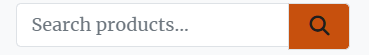

# Flour & Ferment - E-commerce Web App

## Intro

For my fifth portfolio project, I created an e-commerce platform designed for sourdough bread baking enthusiasts.  The site allows users to browse and purchase a variety of sourdough equipment, from starters to flours, baking equipment and cookbooks.  Users can create accounts, manage orders, add products to their wishlist, contact the site administrators and receive email notifications for their purchases.

Administrators have the ability to manage products, respond to customer inquiries, and oversee transactions through a dedicated dashboard. Built using Django, PostgreSQL, and AWS, Flour & Ferment offers an engaging, user-friendly shopping experience for bakers of all levels.


Visit the deployed site here: [Flour & Ferment](https://pp5-ci-flour-and-ferment-b9db037d992a.herokuapp.com/)

View Flour & Ferment on [Github](https://github.com/EJFleet/pp5-flour-and-ferment)

For Admin access with relevant sign-in information: [Flour & Ferment Admin](https://pp5-ci-flour-and-ferment-b9db037d992a.herokuapp.com/admin/)

For the details of all testing carried out, please go to [TESTING.MD](docs/testing/TESTING.md)


---

* [User Experience (UX)](#user-experience-ux)
  * [User Stories](#user-stories)
  * [Design](#design)
    * [Planning](#planning)
    * [Imagery](#imagery)

* [Features](#features)
  * [Future Implementations](#future-implementations)

* [Project Management & Agile Methodologies](#project-management--agile-methodologies)
  * [Kanban Board](#kanban-board)
  * [MoSCoW Prioritisation](#moscow-prioritisation)

* [Technologies Used](#technologies-used)
  * [Languages](#languages)
  * [Frameworks, Libraries & Packages](#frameworks-libraries--packages)
  * [Tools](#tools)

* [Deployment & Local Development](#deployment--local-development)
  * [Forking the GitHub Repository](#forking-the-github-repository)
  * [Cloning the GitHub Repository](#cloning-the-github-repository)
  * [Deploying to Heroku](#deploying-to-heroku)

* [Credits](#credits)
  * [Code Inspiration](#code-inspiration)
  * [Acknowledgments](#acknowledgments)

---

## User Experience (UX)

The user experience (UX) for this project was designed with careful consideration of user needs and project goals, ensuring a seamless, intuitive, and engaging experience for all users. The planning process was informed by Agile methodologies and centered around user stories, categorized into epics to structure development priorities effectively.


<details>

<summary> Epics and User Stories screenshot </summary>


</details>

[Link to original document](https://docs.google.com/spreadsheets/d/1DywOsRNp3SZfBRsrRaIck3M5WMe0I2QfKYrEEFMTcZw/edit?usp=sharing)

  ### User Stories

#### **Navigation**  

As a user, I can:  
- Use a simple navigation menu so that I can easily find content.  
- View a responsive navigation menu on any screen size so that navigating the site remains easy on all my devices.  
- See login-dependent navbar links so that I can access relevant options when logged in or logged out.  

---

#### **Products**  

As a user, I can:  
- Browse a list of available products so that I can see what is for sale.  
- View details of a product so that I can learn more about it before purchasing.  
- Filter products by category so that I can find relevant items more easily.  
- Search for products so that I can find items that match my needs.  

As a logged-in user, I can:
- Add products to my wishlist so that I can easily find them for purchasing later.

---

#### **Shopping Basket**  

As a user, I can:  
- Add items to my basket so that I can purchase them later.  
- Remove items from my basket so that I can adjust my order before checkout.  
- See a summary of my basket so that I can review my order before purchasing.  
- View a running total of my basket so that I can keep track of my spending.  

---

#### **Purchasing & Checkout**  

As a user, I can:  
- Securely enter my payment and shipping details so that I can place an order.  
- See a confirmation page after placing an order so that I know my order was successful.  
- Receive an order confirmation email so that I have a record of my purchase.  

---

#### **User Authentication**  

As a user, I can:  
- Create an account so that I can save my details for future purchases.  
- Log in and out securely so that my account remains private.  

---

#### **User Profiles**  

As a logged-in user, I can:  
- View my past orders so that I can keep track of my purchase history.  
- Update my profile information so that my details are always correct. 
- View my wishlist so that I can add products to my basket or remove them from my wishlist. 

---

#### **About Page**  

As a user, I can:  
- View the About page so that I can understand the purpose and mission of the site.  

---

#### **Support & FAQ**  

As a user, I can:  
- Contact the site owner via a form so that I can ask for help if needed.  
- See a confirmation message after submitting a query so that I know my message was sent.  
- Read an FAQ section so that I can find answers to common questions.  

---

#### **SEO & Marketing**  

As a site owner, I can:  
- Add SEO-friendly meta descriptions so that my site ranks well in search engines.  
- Generate a sitemap so that search engines can easily index my pages.  
- Implement a robots.txt file so that search engines can properly crawl my site.  
- Create a Facebook page so that users can follow and engage with the brand.  
- Include social media links in the footer so that users can easily find and interact with the business.  
- Provide a privacy policy so that users can understand how their data is handled.  
- Have a newsletter signup so that I can collect emails for marketing purposes.  

---

#### **Product Management (Frontend CRUD)**  

As a site admin, I can:  
- Add new products so that I can expand the store's inventory.  
- Update existing products so that information remains accurate and relevant.  
- Delete products so that I can remove outdated or discontinued items.  

---

#### **Admin Panel Management**  

As a site admin, I can:  
- Manage user accounts so that I can remove or update users if necessary.  
- Manage orders so that I can keep track of sales and customer purchases.
- View messages sent by site users from the contact form page so that I can reply to queries.
- Bulk manage products so that I can efficiently update multiple items at once.  


### Design

#### Planning

##### Structure

The Flour & Ferment app is designed with a simple structure to ensure the app is easy to use and navigate. Each page has a consistent layout to allow users to easily find the information they need. The app has a responsive design to ensure it can be clearly viewed on a wide range of devices. The navigation menu is available on all pages of the app to provide users with a consistent method to navigate the site. Bootstrap rows and columns have been used to provide a clean and uniform structure to the content of each page.

##### Wireframes

The wireframes that I originally designed have slightly different aesthetic differences to the finished product. During the construction process, I decided to change the format and layout of some of the features. The original wireframes are below - though the concept evolved, the original layout is still relevant and can be recognised in the finished site.

<details>

<summary> base.html - desktop and mobile </summary>


</details>

<details>

<summary> index.html - desktop and mobile </summary>


</details>

<details>

<summary>recipe_detail.html - desktop</summary>


</details>

<details>

<summary>recipe_detail.html - mobile</summary>


</details>


#### Database Design

The database design for this project consists of the following models:
- **model**: Represents ...
- **model**: Represents ...


### Database Evolution

The initial Entity Relationship Diagram (ERD) was created during the planning phase to represent the anticipated relationships between the models. However, as development progressed, certain requirements and challenges emerged that led to changes in the database structure. This is a common aspect of Agile development, allowing flexibility to adapt to new insights.

<details>

<summary> Current ERD  </summary>
  


</details>

<details>

<summary> Original ERD </summary>


</details>


#### Colour Scheme

The colour scheme was chosen to give a fresh, clean look to the app that does not distract from the text and images of the products and recipes and to provide contrast for good readability of the information. The colour palette was created using [Coolors](https://coolors.co/).

<details>

<summary> Colour Palette  </summary>

  


</details>


#### Fonts
  
The following [Google Fonts](https://fonts.google.com/) fonts were chosen to create a **modern, elegant, and highly readable** user experience.

- **Playfair Display**: A sophisticated serif font with a **classic yet contemporary** feel, used for headings and key display text. Its high contrast and refined letterforms add a touch of **elegance and professionalism** to the site's design.
  
- **Merriweather**: A highly readable serif font designed for **comfortable, long-form reading**, used for body text and general content. Its **balanced proportions and slightly condensed style** ensure clarity across all screen sizes.

Together, these fonts create a **harmonious blend of elegance and readability**, reinforcing the site's aesthetic while maintaining usability.


#### Imagery

- All images used for...
- All images used for ... were downloaded for free from [Pexels](https://pexels.com)
- Hero image: Photo by <a href="https://unsplash.com/@mcthilda?utm_content=creditCopyText&utm_medium=referral&utm_source=unsplash">Mathilda Khoo</a> on <a href="https://unsplash.com/photos/brown-bread-on-stainless-steel-surface-U1IBTApJdFY?utm_content=creditCopyText&utm_medium=referral&utm_source=unsplash">Unsplash</a>
      

  <details>

  <summary>Favicon was created using <a href="https://favicon.io">favicon.io</a></summary>
    
  

  </details>


---

## Features

### General Features

This website provides a seamless and user-friendly experience for purchasing sourdough baking supplies. Below are the key features that enhance usability and functionality:

#### Navigation

- **Responsive Navigation Bar**: The site features a fixed-top navbar with dropdown menus for easy access to products and site pages.
- **Search Functionality**: Users can search for products using a search bar located in the navbar.

<details>

<summary> Details </summary>

It includes links to the following pages:
- Home (by clicking on the app logo)
- Our Story, FAQ and Contact (dropdown menu from About)
- Login/Register (logged out users)
- My Profile, My Wishlist and Logout (dropdown menu from Account - logged in users only)
- Admin, Add New Product, Edit/Delete A Produt (dropdown menu from Admin - admin users only)

It also includes:
- a search bar 
- a shopping basket icon with the total price of the contents of the user's basket

**Key Features**:
- Fixed to the top of the screen in all views to allow for easy navigation.
- Adjusts automatically for different screen sizes.
- On smaller screens, it collapses into a dropdown toggler for a cleaner and more user-friendly interface.

**Screenshots**:


</details>


---

#### Footer
The site displays a footer on all pages which is fully responsive at all screen sizes. It provides essential navigation and engagement options for users. It is structured into different sections for easy accessibility.

<details>

<summary> Details </summary>

Navigation Links
- **Site Pages**: Quick links to key pages including Home, Shop, Our Story, FAQ, and Contact.
- **Account Links**: Options for users to register or log in to their account (logged-out users) or access their profile, wishlist or logout (logged-in users)

Social Media
- **Follow Us**: Links to social media platforms such as Facebook, X (Twitter), Instagram, and YouTube.
- **Icons**: Social media icons are displayed for quick recognition.

Newsletter Subscription
- **Call to Action**: Users are encouraged to subscribe for exclusive offers.
- **Email Input**: A simple form is provided via MailChimp for users to enter their email and subscribe.
- **Styled Button**: A visually distinct "Subscribe" button for engagement.

Legal & Branding
- **Copyright Notice**: Displays the current year and company name.
- **Privacy Policy**: A link to the site's privacy policy.

**Screenshots**:


</details>

---

### Shop 

The **Shop** allows users to browse all available products, filter by categories, and sort items based on price, name, and category.

#### Key Features:
- **Category Selection**: Users can browse by category using category badges.
- **Search & Sorting**: A search bar and sorting dropdown help users find products easily.
- **Product Grid**: Displays products with images, prices, and quick access to product details.
- **Admin Controls**: Admin users can edit or delete products directly from the shop page.

#### Product Cards:
- **Product Image & Name**: Clicking on an image or name redirects users to the product detail page.
- **Price Display**: Clear product pricing with currency formatting.
- **Category Links**: Products are linked to their respective categories for easy navigation.

<details>

<summary> Screenshots </summary>


</details>

---

#### Product Detail Page

The **Product Detail Page** provides an in-depth look at each product, including descriptions, images, and purchase options.

##### Key Features:
- **High-Quality Product Images**: Clickable images allow users to view the full-size product image.
- **Detailed Description**: Displays product information, price, and category.
- **Add to Basket**: Users can specify a quantity and add the product to their basket.
- **Wishlist Integration**: Logged-in users can add the product to their wishlist.
- **Admin Controls**: Superusers can edit or delete products from this page.
- **Related Products**: The page suggests similar products that users might be interested in.
- **Quick Navigation**: Users can return to the shop page or continue shopping with ease.

<details>

<summary> Screenshots </summary>


</details>

---


#### Shopping Basket
- **Add to Basket**: Items can be easily added to the basket from product pages.
- **Basket Overview**: Users can view their basket summary, including item quantities and total cost.
- **Update & Remove Items**: Items can be adjusted or removed from the basket before proceeding to checkout.

**Screenshots**:


---

#### Checkout Process
- **Secure Checkout**: The site integrates Stripe for secure payments.
- **Order Summary**: Users receive a breakdown of their purchase before confirming payment.
- **Order Confirmation**: A confirmation page is displayed upon successful purchase.


---

### **Search & Filtering**

#### **Search Products**
Users can search for products by keywords in their title or description.

<details>

<summary> Details </summary>

**Key Features**:
- A search box available in the navigation bar on all pages.
- Results dynamically update based on the search query.
- Message displays with search box underneath if no results for search query

**Screenshots**:

Search box Desktop:



Search results page for 'book':


Zero search results:


---

### **User Account Features**

#### **Registration**
Users can sign up for an account to access additional features such as viewing order history and saving products to a wishlist.

<details>

<summary> Details </summary>

**Key Features**:
- A registration form with fields for username, email, and password.
- Password validation to ensure security.

**Screenshots**:

Desktop:


Mobile:


</details>


---

#### **Login/Logout**

Users can securely log in and out of their accounts to maintain session integrity.

<details>

<summary> Details </summary>

**Key Features**:

- Login form that authenticates users using their credentials.
- A logout option available in the Account dropdown menu in the navigation bar when logged in.
- Login status displayed in the top of the Account dropdown menu.
- Success messages displayed upon logging in or logging out.


**Screenshots**:

Login Form:


Logout Form:


Logged-in Status:


Login Confirmation:


Logout Confirmation:


</details>

---

#### **User Authentication Error Handling**

The application provides comprehensive error handling for user authentication processes, ensuring users receive clear feedback when encountering issues during login or sign-up.

<details>

<summary> Details </summary>

**Key Features**:

- **Incorrect Password on Login**: Users are shown an error message if they enter an incorrect password while trying to log in, ensuring they understand the issue.
- **Nonexistent Username on Login**: If a user attempts to log in with a username that doesn't exist, they are informed via an error message, maintaining clarity and security.
- **Non-original Username on Sign Up**: During sign-up, users attempting to register with a username that already exists receive an error message, enforcing unique usernames.
- **Unmatching Passwords on Sign Up**: The "password" and "confirm password" fields must match during sign-up; otherwise, an error message is displayed.
- **Too Short Password on Sign Up**: Passwords are validated for minimum length, and users entering too-short passwords are informed with an error message to enhance security.
- **Invalid Email Address on Sign Up**: The email field checks for valid formatting, ensuring users cannot register with improperly formatted email addresses.

**Screenshots**:

- **Error for Incorrect Password and/or Nonexistent Username on Login**:


- **Error for Non-original Username on Sign Up**:


- **Error for Unmatching Passwords on Sign Up**:


- **Error for Too Short Password on Sign Up**:


- **Error for Invalid Email Address on Sign Up**:


</details>

---


### **Admin/Staff-Specific Features**

#### **Admin Panel**
Admins can manage the site content directly from the Django admin panel.

<details>

<summary> Details </summary>

**Key Features**:
- Manage users, products, product categories, orders, faq, wishlists and queries.
- View and filter data using the admin interface.
- Bulk actions like deleting multiple products.

**Screenshots**:


</details>

---

#### Product Management (Admin/Staff Only)
Staff and admin users can manage product listings directly from the site or the admin panel.

<details>

<summary> Details </summary>

**Key Features**:
- **Add Product**: Staff can create a new product with fields for SKU, Category, Name, Description, Price, Image URL and Image
- **Edit Product**: Staff can update any aspect of the product - accessed via Edit button on product on Products listing page or Edit icon on Product Detail page
- **Delete Product**: Staff can permanently delete a product - accessed via Delete button on product on Products listing page or Delete icon on Product Detail page

**Screenshots**:

- Add product Form: 


- Edit Product Form: 

This is the same as the form for creating a product, except that it is prepopulated with the product details.


- Delete Product Confirmation:

Before a staff/admin user deletes a product, via Edit button under the product image on the Products page, or the icon on the Product Detail page, a confirmation modal is displayed with the option to continue with deletion or to cancel the action.


</details>

----

### **About Menu Features**

#### **Our Story Page**
Users can view a dedicated page about the mission, services and community behind the site.

<details>

<summary> Details </summary>


**Screenshots**:


</details>


---

#### FAQ Page

The FAQ (Frequently Asked Questions) page provides quick and helpful answers to common customer inquiries.

<details>

<summary> Details </summary>


**Screenshots**:


</details>


#### Contact Page

The Contact page provides users with an easy way to reach out for inquiries, support, or feedback. 

##### Contact Form
- **User-Friendly Form**: Includes fields for name, email, subject, and message.
- **Validation**: Ensures required fields are filled before submission.
- **Submit Button**: Users can send their messages directly through the site.
- **Contact Success page**: A confirmation page is displayed after the message is sent successfully.

<details>

<summary> Details </summary>


**Screenshots**:


</details>

---

### **Account Menu Features**


#### **My Profile Page**

The **My Profile** page allows users to manage their personal details and access details of previous orders. 

<summary> Details </summary>

#### **Key Features**
- **Profile Information**: Users can view their registered name, email, and other personal details.
- **Update Profile Details**: Users can modify their contact information, such as email or address.
- **Order History**: A list of past purchases with order details, including date, status, and total amount.

**Screenshots**:


</details>


---

#### My Wishlist

Logged-in users can save items to their wishlist for future purchasing, via the heart icon on the product detail page.

Clicking on 'My Wishlist' displays the wishlist and items can be viewed and removed as needed.  Items can be quickly moved from the wishlist to the basket for easy purchase via the 'Add to Basket' button.

<details>

<summary> Details </summary>


**Screenshots**:


</details>

---


</details>

---
### Error Pages

#### Custom Error Pages

The app provides user-friendly custom error pages for HTTP errors including `403 Forbidden`, `404 Not Found`, `405 Method Not Allowed`, and `500 Internal Server Error`. This ensures users are presented with clear and aesthetically pleasing error messages, maintaining a professional look even when something goes wrong.

<details>

<summary> Details </summary>

- **403 Forbidden**:
  - Displayed when a user attempts to access a restricted page or perform an unauthorized action.
  - Message: "Sorry, you are not authorised to perform this action"
  
- **404 Not Found**:
  - Displayed when a user tries to access a page that does not exist.
  - Message: "Sorry, the page you are looking for does not exist."

- **405 Method Not Allowed**:
  - Displayed when a user tries to perform an HTTP method that is not supported by the server for a specific URL.
  - Message: "Sorry, the method you are trying to use is not allowed on this page."

- **500 Internal Server Error**:
  - Displayed when an unexpected error occurs on the server.
  - Message: "Something went wrong on our end. Please try again later."

Each error page includes:
- A **consistent site layout** to keep users oriented.
- A **clear message** explaining the error.
- A **call-to-action link**, the "Back Home" button, to help users navigate back to the main site.

- **404 Not Found**
  

- **500 Internal Server Error**
  

</details>

---


## Future Implementations

As the platform evolves, additional features and improvements may be introduced to enhance user experience, streamline operations, and expand functionality.


### **User Profiles & Authentication**
- Allowing users to update their passwords for enhanced security.

### **Content & Recipes**
- Introducing a dedicated recipe section with categorized listings and detailed recipe pages.
- Implementing a tagging system for recipes to improve discoverability.
- Adding search functionality for recipes to allow users to find relevant content quickly.

---
  
## Project Management & Agile Methodologies

### Agile Development

This project was developed using Agile methodology which allowed me to iteratively and incrementally build my app, with flexibility to make changes to my design throughout the entire development process.

#### Kanban Board

GitHub Issues and Projects were used to manage the development process. Each part of the app is divided into Epics which are broken down into User Stories with Tasks. An Epic represents a large body of work, such as a feature. The board view of the Project feature was used to display and manage my progress in the form of a 'kanban board'. The user stories were added to the 'Todo' column to be prioritised for development, moved to the 'In Progress' column to indicate development of the feature had begun and finally moved to the 'Done' column when the feature had been implemented and the acceptance criteria had been met.

<details>

  <summary> Kanban Board  </summary>

  

</details>

[The Project Kanban Board](https://github.com/users/EJFleet/projects/3)

#### MoSCoW Prioritisation

User stories were prioritised using the MoSCoW prioritisation technique. Each user story was given one of the following labels:

- Must have - to indicate the user story is guaranteed to be delivered.
- Should have - to indicate the user story would add significant value but is not vital.
- Could have - to indicate the user story would have a small impact if left out.
- Won't have - to indicate the user story is not a priority in the current iteration.

---

## Technologies Used


### Languages

- [HTML5](https://en.wikipedia.org/wiki/HTML5)
- [CSS3](https://en.wikipedia.org/wiki/CSS)
- [JavaScript](https://en.wikipedia.org/wiki/JavaScript)
- [Python](https://en.wikipedia.org/wiki/Python_(programming_language))


### Frameworks, Libraries & Packages
  
- [Django 4.2.16](https://docs.djangoproject.com/en/4.2/) - The main web framework used to build the application, creating models, views and templates.
- [Bootstrap 4](https://getbootstrap.com/) - front-end CSS framework for modern responsiveness and pre-built components
- [Font Awesome 5.15.4](https://fontawesome.com/) - social media icons in footer
- [Google Fonts](https://fonts.google.com/) - fonts used on the app
- [django-crispy-forms](https://django-crispy-forms.readthedocs.io/en/latest/) - enhanced form rendering with customizable styles and better integration with Bootstrap
- [cripsy-bootstrap5](https://github.com/django-crispy-forms/crispy-bootstrap5) - Bootstrap 5 styling support to `django-crispy-forms`
- [django-allauth](https://django-allauth.readthedocs.io/en/latest/) - user authentication, registration, and account management
- [Gunicorn](https://gunicorn.org/) - used for WSGI server
- [psycopg2](https://pypi.org/project/psycopg2/) - PostgreSQL adapter for Python, used to interact with the PostgreSQL database
- [django-summernote](https://summernote.org/) - WYSIWYG text editor integrated into Django admin and forms for creating rich-text content
- [cloudinary 1.36.0](https://cloudinary.com/) - managing and serving images using the Cloudinary API
- [whitenoise (5.3.0)](https://whitenoise.readthedocs.io/en/latest/) - serving static files in production


### Tools

- [Git](https://git-scm.com/) - version control
- [GitHub](https://github.com/) - save and store the files for the app
- [GitPod](https://gitpod.io/) - developing the app
- [Heroku](https://heroku.com/) - deploying the app
- [PostgreSQL](https://www.postgresql.org/) - database
- [Cloudinary](https://cloudinary.com/) - storing images
- [Balsamiq](https://balsamiq.com/) - wireframes
- [Lucid.app](lucid.app) - creating the ERD
- [Coolors](https://coolors.co/) - colour scheme
- [Am I Responsive](https://ui.dev/amiresponsive) -responsive screenshots
- [favicon.io](https://favicon.io/) - custom favicon
- [FontAwesome](https://fontawesome.com/) - social media icons in footer
- [ChatGPT](https://chatgpt.com/) - debugging and formatting
- [The W3C Markup Validation Service](https://validator.w3.org/) - validating HTML
- [The W3C CSS Validation Service](https://jigsaw.w3.org/css-validator/) - validating CSS
- [Code Insitute PEP8 Validator](https://pep8ci.herokuapp.com/#) - validating the Python code
- [JSHint](https://jshint.com/) - validating JavaScript
- [Chrome DevTools](https://developer.chrome.com/docs/devtools/)
- [Codebeautify.org](https://codebeautify.org/python-formatter-beautifier) - formatting the code
- [Shields.io](https://shields.io/) - adding badges to the readme
- [Django Secret Key Generator](https://djecrety.ir/) - generating a secret key
- [Pexels](https://www.pexels.com/) - team member photos


##  Deployment & Local Development    

  
### Forking the GitHub Repository

  A copy of the original repository can be made through GitHub. Please follow the below steps to fork this repository.

  <details>
  <summary>Steps for forking GitHub Repository</summary>

  1. Navigate to GitHub and log in.  
  2. Once logged in, navigate to this repository using this link [My Cookbook Repository](https://github.com/EJFleet/pp4-my-cookbook-blog).
  3. Above the repository file section and to the top, right of the page is the '**Fork**' button, click on this to make a fork of this repository.
  4. You should now have access to a forked copy of this repository in your Github account.

  </details>

  -----

  ### Cloning the GitHub Repository

  A local clone of this repository can be made on GitHub. Please follow the below steps.

  <details>
  <summary>Steps for cloning GitHub Repository</summary>

  1. Navigate to GitHub and log in.
  2. The [My Cookbook Repository](https://github.com/EJFleet/pp4-my-cookbook-blog) can be found at this location.
  3. Above the repository file section, locate the '**Code**' button.
  4. Click on this button and choose your clone method from HTTPS, SSH or GitHub CLI, copy the URL to your clipboard by clicking the '**Copy**' button.
  5. Open your Git Bash Terminal.
  6. Change the current working directory to the location you want the cloned directory to be made.
  7. Type `git clone` and paste in the copied URL from step 4.
  8. Press '**Enter**' for the local clone to be created.

  For more details about forking and cloning a repository, please refer to [GitHub documentation](https://docs.github.com/en/get-started/quickstart/fork-a-repo).


  </details> 

---

 
### Code Institute PostgreSQL Database

<details>

<summary>Details</summary>

1. Create an [Code Institute PostgreSQL](https://dbs.ci-dbs.net/manage/KeeMR5RVAMT6WX8k/) account.
2. Create a new instance.
3. Copy the database URL.
4. Add database to the settings.py-file in Django.

</details>

---
  
### Cloudinary API 

Cloudinary provides a cloud hosting solution for media storage. All users uploaded images in the FreeFid project are hosted here.

<details> 

<summary>Details</summary> 

Set up a new account at [Cloudinary](https://cloudinary.com/) and add your Cloudinary API environment variable to your **env.py** and Heroku Config Vars.
In your project workspace: 

- Add Cloudinary libraries to INSTALLED_APPS in settings.py 
- In the order: 
```
   'cloudinary_storage',  
   'django.contrib.staticfiles',  
   'cloudinary',
```
- Add to **env.py** and link up with **settings.py**: ```os.environ["CLOUDINARY_URL"]="cloudinary://...."``` 
- Set Cloudinary as storage for media and static files in settings.py:
- ```STATIC_URL = '/static/'```
```
  STATICFILES_STORAGE = 'cloudinary_storage.storage.StaticHashedCloudinaryStorage'  
  STATICFILES_DIRS = [os.path.join(BASE_DIR, 'static'), ]  
  STATIC_ROOT = os.path.join(BASE_DIR, 'staticfiles')‌  
  MEDIA_URL = '/media/'  
  DEFAULT_FILE_STORAGE = 'cloudinary_storage.storage.MediaCloudinaryStorage'
```
</details>

---

### Deploying to Heroku

<details>

<summary> Deploying to Heroku </summary>

To get the Django framework installed and set up I followed the Code institutes [Django Blog cheatsheet](docs/django-blog-cheatsheet.pdf)


</details>

-----
<br>

## Credits
---

### Code Credits
  
| Source | Location | Notes |
| --- | --- | --- |

    
### Acknowledgments

  * My mentor Brian Macharia for his help and clear explanations of what needed to be done
  * Lewis Dillon for facilitating our weekly standups and being a font of information and encouragement
  * My friends and family for testing the project on their devices and offering words of encouragement
  * God for getting me through the tough bits
  * My dog Po for making me take breaks from my desk